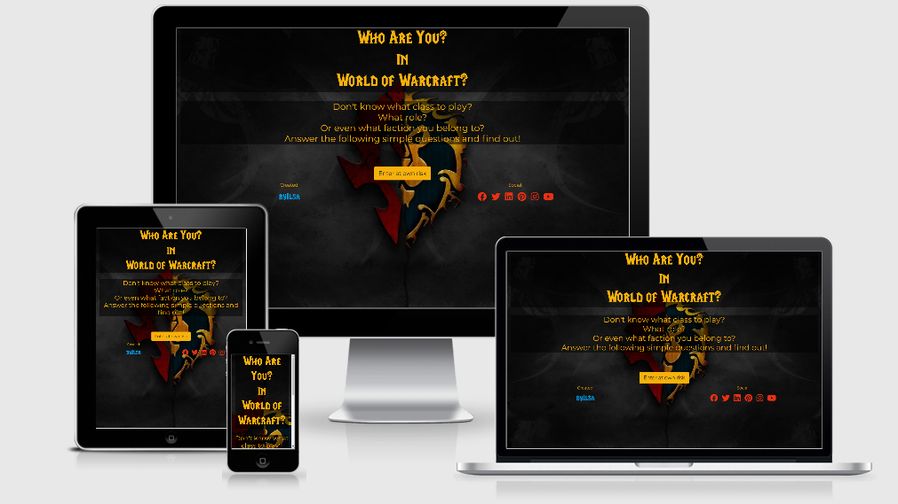

# WAY! #
*Who Are You in World of Warcraft*


## Table of Content ##
---
  * [UX (User Experience)](#ux--user-experience-)
    + [Project Goals](#project-goals)
    + [User Goals](#user-goals)
    + [User Stories](#user-stories)
    + [Site Owner Goals](#site-owner-goals)
    + [User Requirements and Expectations](#user-requirements-and-expectations)
    + [Design Choices](#design-choices)
  * [Wireframing](#wireframing)
  * [Features](#features)
  * [Technologies used](#technologies-used)
  * [Testing](#testing)
  * [Bugs](#bugs)
  * [Deployment](#deployment)
  * [Credits](#credits)


---
## UX (User Experience) ##


---
### Project Goals ###
The **ultimate quiz** to decide for **once and for all** which faction, race, class and role you belong to in the popular MMORPG [World of Warcraft](https://worldofwarcraft.com/en-us/).

The **goal** for this project is to **entertain** users.

While I at first intended to use all playable classes, races and roles, I soon found out that was a bit to much, so I decided to include all playable classes, races and roles up to and including the [Original World of Warcraft Classic Game](https://worldofwarcraft.com/en-us/wowclassic).
I had a really hard time getting my data in a structure I could work with. So I decided to compress a lot of questions and not use three json files, but instead use one, just to make it more easy on myself as I was approaching a point to I almost had a burn-out.

### User Goals ###
:punch:
* **Find** out which [World of Warcraft](https://worldofwarcraft.com/en-us/) faction, race, class and role you are.
* Be **entertained**.
* **Find** beautiful **images** of World of Warcraft races and classes.

### User Stories ###
:punch:
* As a **user**, I want and **attractive** and **fun** website so I will be **entertained**.
* As a **user**, I want a **site** that loads fast.
* As a **user**, I want to have clearly defined **questions** and **answers**.

### Site Owner Goals ###
:punch:
* As a **site owner** I want to educate my users.

### User Requirements and Expectations ###
:point_down:
**Requirements**

* Have a **intuitive** layout that is easy to use.
* **Fun questions** that lead to an **equally fun** (and perhaps true) **outcome**.
* **social media** buttons in the footer.

**Expectations**
* Quiz is **easy** to use and gives **no errors**.
* Content is **appealing**.

### Design Choices ###

:video_game:

When **designing** this site, I mainly did a **lot of thinking**. Where **coming up** with the idea wasn't all that hard, the **getting the data structured and usable**, was a whole different ball game.
I've looked at [**other quizzes**](https://www.zimbio.com/quiz/xB6XYrSQXCE/World+Warcraft+Class) that follow a path that is similar to mine and went from there.

**Fonts**

:heart_eyes:

For the text i've used [Montserrat](https://fonts.google.com/specimen/Montserrat?query=mont) which come pretty close to the fonts Blizzard uses for their World of Warcraft site.
I also used a **custom font** that is used my Blizzard itself; [LifeCraft](https://www.dafont.com/lifecraft.font) which i've used for the title.

**Icons**

:bell:

**Icons** used where provided by [Font Awesome](https://fontawesome.com/), used in **moderation** and are self explanatory.

**Colors**

:hearts:

Colors that are used, are based on the World of Warcraft colors.
* For body background: Black #000000
* For buttons:  Yellow #F7B10A, Blue #009AE4 and Red #EA3012
* For text: Yellow #F7B10A, Blue #009AE4 and Red #EA3012.


## Wireframing ##

:clipboard:
For **wireframing** I used [Pencil Prototyping](https://pencil.evolus.vn/).

View my wireframes [here](https://github.com/byIlsa/WAY/tree/master/wireframes).

To be more precise:

* [Desktop Wireframe](https://github.com/byIlsa/WAY/blob/master/wireframes/desktop.pdf)
* [Tablet Wireframe](https://github.com/byIlsa/WAY/blob/master/wireframes/tablet.pdf)
* [Mobile Wireframe](https://github.com/byIlsa/WAY/blob/master/wireframes/mobile.pdf)

## Features ##
---
**Features** that have been **implemented:**

:muscle:
* A **fun** and perhaps **informative** quiz.
* Social Media **buttons**.
* **Images** that are **appealing**.

**Features** that will be **implemented** in the **future:**

:raised_hands:
* **Fantasy name generator**: Let's user generate a **character name** to go with the **outcome of the quiz**.
* Option to **check** if that **name** is already **taken** (through an API).
* Option to choose between the **different expansions**. With **every new expansion**, **more classes and races** were added. For future features, I would like to **include** them as well.
* Social media **share buttons**.

**Features** that where in the **wireframes** but did not make it in **this version:**

* **Change of color** when choosing a faction. 
    * Sadly, due to time constraints, I wasn't able to add this feature. :disappointed:

## Technologies used ##
---
**Languages**

:speak_no_evil:
* [HTML](https://developer.mozilla.org/en-US/docs/Web/HTML)
* [CSS](https://developer.mozilla.org/en-US/docs/Web/CSS)
* [JS](https://nl.wikipedia.org/wiki/JavaScript)

**Tools & Libraries**

:see_no_evil:
* [Git](https://git-scm.com/)
* [Bootstrap](https://getbootstrap.com/)
* [Font-Awesome](https://fontawesome.com/icons?d=gallery)
* [Google fonts](https://fonts.google.com/)
* [Gimp](https://www.gimp.org/)
* [JQuery](https://jquery.com/)
* [Popper](https://popper.js.org/)

## Testing ##
---
I've tested everything extensively through **chrome developer tools**, making sure responsiveness was reacting the way it should. 

* I've used **JSHint** to check the javascript code, which did not reveal a problem.

* Ive tested the CSS with [CSS Validator](http://jigsaw.w3.org/css-validator/) which told me that all was **good**.

* The HTML I've tested with [HTML Validator](https://validator.w3.org/) which gave me the following **results:**
    * [Test1](https://github.com/byIlsa/WAY/blob/master/assets/images/HTMLtest1.png)
        * This gave me an **error**. I needed to give the h3 class a title. I changed it and tested again;
    * [Test2](https://github.com/byIlsa/WAY/blob/master/assets/images/HTMLtest2.png)
        * **Result:** No more errors.

* Testing for browsercompatability was done through [Lambdatest](www.lambdatest.com). I've made a report, check it out [here](https://github.com/byIlsa/WAY/blob/master/assets/images/browserTest.png). The **results** are being discussed in the **bug section** of this readme.       


**Responsiveness**

:horse_racing:
* **Implementation**     Ive used **Bootstrap** throughout the project to ensure **maximum** responsibility. Ive tested with **devtools** and **Lambdatest**.

* **Results**   **Responsiveness** was as to be expected.

* **Verdict**    The test has **passed**.

**Design**

:crown:
* **Implementation**   The **design** of the site was based on the design of the **World of Warcarf** website, using 'look-a-like' fonts, as the fonts used are custom for them. I used some of the colors and styles for a sense of familiarity for people who know the game
and would attract people who dont know the game yet.

* **Results** I feel the use of fonts and colors really add up to the **content** and make for a **well balanced** whole.

* **Verdict** Everything is working and looks good. So this test has **passed**.


## Bugs ##
---
**During development**

:bug: **Bug:** Buttons not reacting the way I expected.

:memo: **Description:** I was looping through the answers array with a `forEach loop`, but couldn't make the answers being injected into the buttons. And the buttons where underneath each other, instead of hiding when an answer was clicked.
This has been very frustrating for me, as I felt I was throwing everything I knew at it, including and not limited to documentation, video's and asking help on Slack.
I asked tutor support in the end, who have helped me figure this out. Their hints combined with the help of Mr Bim, has led me to understand what was causing this and how to solve it. 
Part of this was having a array like collection which led to me not being able to use a `forEach loop` which started this whole thing.

:heavy_check_mark: **Solution:** Change the `document.querySelector` to be `document.querySelectorAll()` and use `for loops` so the answers where actually being appended to the amount of buttons that where needed.

:bug: **Bug:** Some loops in the questions weren't leading to a 'null no yes' solution but seemed infinite. 

:heavy_check_mark: **Solution:** Found out which question wasn't referring to the right ID number and fixed that. 

:bug: **Bug:** The restart function wasn't working. This one had my head spinning and was very easy to solve! 

:heavy_check_mark: **Solution:** Install a code spell checker... It took a mentor to point to a spelling mistake in the word "answers"... Won't happen again; code spell checker installed. :thumbsup: 

**From validation/testing**

:bug: **Bug:** Boyfriend test: Wrong result id showing.

:heavy_check_mark: **Solution:** Check flow of json and changed a few id's so the correct result id's show.

:bug: **Bug:** (As from lambdatest:) Game not displaying correct on **Edge and Firefox browser**, due to those browsers **not** having **compatability** for **Optional Chaining Operators**. Boohoo....

:heavy_check_mark: **Solution:** Use a standard `for loop` instead of the fancy **Optional Chaining Operators**.

:bug: **Bug:** Footer not sticking to bottom of page.

:heavy_check_mark: **Solution:** Due to time constraints this bug remains unsolved for now.

**From peer code review**

Unfortunately, due to time constraints, I've only let my partner and one friend test the app. That result is talked about in the validation/testing section.

## Deployment ##
---
WAY! was **developed** on **GitPod**, using **git** and **GitHub** to host the repository. I have used **branches** which I did not remove, so the **accessors** can see them as well. I am **aware** that these need to be **removed** in all other cases.

:rainbow:

When deploying WAY! using **GitHub Pages** the following steps were made:

* Opened up **GitHub** in the **browser**.
* Signed in using **username** and **password**.
* Selected my **repositories**.
* Navigated to **byIlsa/WAY**.
* In the top navigation clicked **settings**.
* Scrolled down to the **GitHub Pages** area.
* Selected **Master Branch** from the **Source** dropdown menu.
* Clicked to **confirm** my **selection**.
* WAY! **live** on **GitHub Pages**.

**Running WAY! Locally**

:office:

**Cloning** WAY! from **GitHub**:

* Navigate to **byIlsa/WAY**.
* Click the green **Clone or Download** button.
* **Copy** the url in the **dropdown box**.
* Using your **favorite IDE** open up your **preferred** terminal.
* **Navigate** to your **desired** file **location**.

**Copy** the following code and **input** it into your **terminal** to **clone WAY!**.

```git clone https://github.com/byIlsa/WAY```

## Credits ##
---
**Code Credit**

:clap:
* Epic thanks to [WebDevSimplified](https://github.com/WebDevSimplified) for his [JavaScript text adventure game](https://github.com/WebDevSimplified/JavaScript-Text-Adventure) which I have used as a base for my project.

**Credit for text used on this website**

:clap:
* For [race](https://wowwiki.fandom.com/wiki/Race) descriptions.

* For [class](https://wowwiki.fandom.com/wiki/Class) descriptions.

* For the **questions** I used [this](https://nl.pinterest.com/pin/32299322315435071/) and [this](https://nl.pinterest.com/pin/308144799504856672/), found on pinterest.

**Images used**

:clap:

* [Body background-factions](https://wallpaperplay.com/walls/full/9/1/3/41117.jpg)

* [Crests](https://wowwiki.fandom.com/wiki/Crests)

* [Kel’Thuzad](https://esports.hollywood.com/heroes-of-the-storm-kelthuzad-enters-the-nexus-c173b544737)

<details>
  <summary><strong>Images for results section:</strong></summary>

[Troll Priest](https://www.deviantart.com/daverapoza/art/Troll-priest-112064760) 

[Troll Warrior](https://www.artstation.com/artwork/L2X1bR)

[Troll Hunter](https://www.artstation.com/artwork/WLdAN)

[Troll Mage](https://www.deviantart.com/raben-aas/art/Female-Troll-Mage-733038382)

[Troll Rogue](https://worldofwarcraftthings.tumblr.com/post/105648297575/nickroblesart-zelujin-paint-sketch-digital)

[Troll Shaman](https://www.deviantart.com/vanharmontt/art/Troll-Shaman-1-833726134)

[Troll Paladin](https://i.imgur.com/wXj4JVj.jpg) 

[Tauren Druid](https://www.deviantart.com/vanharmontt/art/Tauren-Druid-832030308)

[Tauren Warrior](https://www.deviantart.com/rogierb/art/Tauren-Warrior-569059971)

[Tauren Hunter](https://i.redd.it/a7y6vjfkbvs21.jpg)

[Tauren Shaman](https://www.artstation.com/artwork/eaRolb)

[Tauren Rogue](https://wow.gamepedia.com/File:Tauren_rogue2.jpg) 

[Undead Priest](https://www.deviantart.com/phamoz/art/WoW-Undead-Priest-811200130)

[Undead Paladin](https://www.wowhead.com/outfit=6479/undead-paladin#screenshots) 

[Undead Warrior](https://www.reddit.com/r/wow/comments/9c3da4/undead_warrior_grevant_by_me/?utm_content=comments&utm_medium=user&utm_source=reddit&utm_name=frontpage)

[Undead Mage](https://www.deviantart.com/thiago-almeida/art/Undead-Mage-286342400)

[Undead Rogue](https://www.deviantart.com/anotherwanderer/art/Undead-Rogue-715219145)

[Undead Warlock](https://www.deviantart.com/kueshkaart/art/Gothess-Undead-Warlock-commission-work-846482734)

[Orc Warrior](https://www.deviantart.com/jordankerbow/art/Warcraft-Female-Orc-Warrior-625504789)

[Orc Hunter](https://www.inprnt.com/gallery/sulamoon/orc-hunter/?__cf_chl_jschl_tk__=278fb2245c5599cf884ad1ca35e7ee7c67759c28-1600778797-0-AdSoF5KVbyhum5fmb0vMfmQGKbyC59QZk8HUqjznLVRZ3bub7JnNpVgMbsBgdMzUcH3u58EK4Lkksh_5O1iKcNAO92VJFUNw8qu4A6gPuv9nIAAqaU89pwRRlKNz_ZF1YjlN1RxkzZS-LHzYwZ3iyanJ2Wo-Cu1tnbzjTiBcGc16HzWYznI7I8Aj2Ba6ZIIW9WxZyEtWbds2383Mpcb4JLulT4huNHEMDSmgZzzvugAEyv-1X9eEHpFQd35c0UzutE5Vzp0rvNngK9gBZiPsIZ3CY5ivLZSrK09U7u7ieO5sJgUg1dyrcdb_MmbvUPZ3N4ktiuESqP3yuFrLTWspSyNOLDGWsbGT2f-rrBsoefDAvhrI22QsztFliEiomZVHTw)

[Orc Rogue](https://www.deviantart.com/weremagnus/art/orc-rogue-35394744)

[Orc Shaman](https://www.deviantart.com/koz23/art/Female-Orc-Shaman-703050797)

[Orc Warlock](https://www.deviantart.com/pokketmowse/art/Orc-Warlock-165451843?q=gallery:pokketmowse/30493974&qo=10)

[Human Priest](http://media.blizzard.com/wow/media/fanart/fanart-0654-full.jpg)

[Human Paladin](https://www.deviantart.com/angevere/art/Paladin-667232071)

[Human Warrior](https://www.reddit.com/r/wow/comments/g95wrb/human_warrior_commission_work_by_me_oksana_kerro/)

[Human Mage](https://www.deviantart.com/ozornin-art/art/Mage-Kirin-Tor-567442162)

[Human Rogue](https://www.deviantart.com/glennraneart/art/World-of-Warcraft-Human-Rogue-157820160)

[Human Warlock](https://www.deviantart.com/ludvikskp/art/World-of-Warcraft-Human-Warlock-739252484)

[Dwarf Priest](https://www.artstation.com/artwork/PmZe3y)

[Dwarf Paladin](https://www.deviantart.com/vanharmontt/art/dwarf-paladin-787325284)

[Dwarf Hunter](https://wall.alphacoders.com/big.php?i=229515&lang=Russian)

[Dwarf Rogue](https://wow.gamepedia.com/File:MadreaBluntbrew.jpg)

[Dwarf Warlock](https://www.wow-accountshop.com/wp-content/uploads/2020/05/lock.jpg)

[Dwarf Warrior](https://www.deviantart.com/lavam00/art/Dwarf-Warrior-828041537) 

[Night Elf Priest](https://www.artstation.com/artwork/rd6R6)

[Night Elf Druid](https://www.artstation.com/artwork/WL2D2)

[Night Elf Warrior](https://www.artstation.com/artwork/APDEq)

[Night Elf Hunter](https://www.deviantart.com/imdrunkontea/art/Night-Elf-Archer-818463468)

[Night Elf Rogue](https://www.artstation.com/artwork/YaJvwK)

[Gnome warrior](https://www.deviantart.com/artlon/art/Commission-Jilette-Sawblaster-533852890)

[Gnome mage](https://www.artstation.com/artwork/xk9nE)

[Gnome warlock](https://www.artstation.com/artwork/1e3WX)

[Gnome Rogue](https://www.storenvy.com/products/4184291-timmo-shadestep)
</details>

For generating a table of content: <small><i><a href='http://ecotrust-canada.github.io/markdown-toc/'>Table of contents generated with markdown-toc</a></i></small>

**Special thanks**

:clap: :clap:

* As always, my mentor [Simen Daehlin](https://github.com/Eventyret), for his support and Yoda-guidance.

* And while Simen was away, I got helped by the awesome [Reuben Ferrante](https://github.com/arex18).

* A big contributor in this project and massive support, not only code wise but also mentally; [Mr Bim Williams](https://github.com/MrBim).

* For her MoneyPot game, that has helped me kick off the JavaScript part of this project, [Neringa Bickmore](https://github.com/neringabickmore).

* For his undying love and support and always being there, my love, you know who you are ;) :hearts: :hearts:

* Everybody at Slack for their support, tips and humor, especially tutors Tim, Roman and Kevin.

**Personal note**

:relieved:

These are trying times...
During this project I had some major life events, not to mention, the whole COVID-19 pandemic which has touched us all.

I have never had so much things going on that have impacted me in ways I didn't expected. A move, some serious illness and other stuff, have forced me to make some tough decisions and really focus on what matters most. Code Institute has been invaluable in attaining this, so a MASSIVE thank you! 

Also, I have never been more proud of myself, with seeing this through! They say raising a child requires a village... I encountered first hand that finishing one of the toughest things I have ever done, requires a village as well!

**Site for educational purposes only!**


