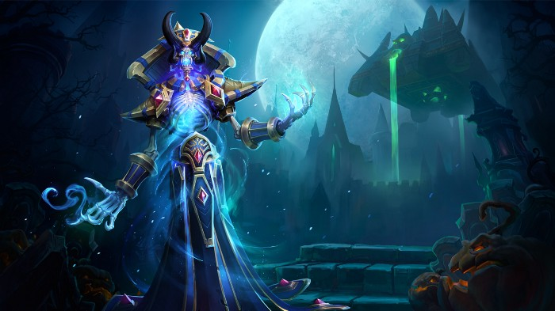

# WAY! #
*Who Are You in World of Warcraft*


---
## UX (User Experience) ##
---
### Project Goals ###
The **ultimate quiz** to decide for **once and for all** which faction, race, class and role you belong to in the populair MMORPG [World of Warcraft](https://worldofwarcraft.com/en-us/).

The **goal** for this project is to **entertain** users.

While I at first intended to use all playable classes, races and roles, I soon found out that was a bit to much, so I decided to include all playable classes, races and roles up to and including the [Original World of Warcraft Classic Game](https://worldofwarcraft.com/en-us/wowclassic).
I had a really hard time getting my data in a structure I could work with. So I decided to compress a lot of questions and not use three json files, but instead use one, just to make it more easy ono myself as I was approaching a point to I almost had a burn-out.
### User Goals ###
* **Find** out which [World of Warcraft](https://worldofwarcraft.com/en-us/) faction, race, class and role you are.
* Be **entertained**.
* **Find** beautiful **images** of World of Warcraft races and classes.

### User Stories ###
* As a **user**, I want and **attractive** and **fun** website so I will be **entertained**.
* As a **user**, I want a **site** that loads fast.
* As a **user**, I want to have clearly defined **questions** and **answers**.

### Site Owner Goals ###
* As a **site owner** I want to educate my users.

### User Requirements and Expectations ###

**Requirements**
* **Navigate** the website using the navbar.
* Have a **intuitive** layout that is easy to use.
* **Fun questions** that lead to an **equally fun** (and perhaps true) **outcome**.
* Be able to **share** results on **social media**.

**Expectations**
* Quiz is **easy** to use and gives **no errors**.
* Result is **sharable** through **social media** share buttons at the results location.
* Content is **appealing**.

### Design Choices ###
When **designing** this site, I mainly did a **lot of thinking**. Where **coming up** with the idea wasn't all that hard, the **getting the data structured and usable**, was a whole different ball game.
I've looked at [**other quizzes**](https://www.zimbio.com/quiz/xB6XYrSQXCE/World+Warcraft+Class) that follow a path that is similar to mine and went from there.

**Fonts**

For titles i've used [Open Sans](https://fonts.google.com/specimen/Open+Sans?query=open+sans) and for the text i've used [Montserrat](https://fonts.google.com/specimen/Montserrat?query=mont) which come pretty close to the fonts Blizzard uses for their World of Warcraft site.

**Icons**

**Icons** used where provided by [Font Awesome](https://fontawesome.com/), used in **moderation** and are self explanatory.

**Colors**
Colors that are used, are based on the World of Warcraft colors.
* For body background: Black #000000
* For buttons:  Yellow #F7B10A, Blue #009AE4 and Red #EA3012
* For text: Yellow #F7B10A.


## Wireframing ##

For **wireframing** I used [Pencil Prototyping](https://pencil.evolus.vn/).

View my wireframes [here](https://github.com/byIlsa/WAY/tree/master/wireframes).

To be more precise:

* [Desktop Wireframe](https://github.com/byIlsa/WAY/blob/master/wireframes/desktop.pdf)
* [Tablet Wireframe](https://github.com/byIlsa/WAY/blob/master/wireframes/tablet.pdf)
* [Mobile Wireframe](https://github.com/byIlsa/WAY/blob/master/wireframes/mobile.pdf)

## Features ##
---
**Features** that have been **implemented:**

* Easy to use **navigation** on all screensizes.
* Social Media **buttons**.

**Features** that will be **implemented** in the **future:**

* **Fantasy name generator**: Let's user generate a **character name** to go with the **outcome of the quizz**.
* Option to **check** if that **name** is already **taken** (through an API).
* Option to choose between the **different expansions**. With **every new expansion**, **more classes and races** were added. For future features, I would like to **include** them as well.
* Social media **share buttons**.

## Technologies used ##
---
**Languages**

* [HTML](https://developer.mozilla.org/en-US/docs/Web/HTML)
* [CSS](https://developer.mozilla.org/en-US/docs/Web/CSS)
* [JS](https://nl.wikipedia.org/wiki/JavaScript)
* [JQuery](https://jquery.com/)
* [Popper](https://popper.js.org/)

**Tools & Libraries**

* [Git](https://git-scm.com/)
* [Bootstrap](https://getbootstrap.com/)
* [Font-Awesome](https://fontawesome.com/icons?d=gallery)
* [Google fonts](https://fonts.google.com/)
* [Gimp](https://www.gimp.org/)

## Testing ##
---
**Responsiveness**

* **Implementation**
* **Results**
* **Verdict**

**Design**

* **Implementation**
* **Results**
* **Verdict**

**Contact form**

* **Implementation**
* **Results**
* **Verdict**

## Bugs ##
---
**During development**
**From validation/testing**
**From peer code review**

## Deployment ##
---
WAY! was **developed** on **GitPod**, using **git** and **GitHub** to host the repository.

When deploying WAY! using **GitHub Pages** the following steps were made:

* Opened up **GitHub** in the **browser**.
* Signed in using **username** and **password**.
* Selected my **repositories**.
* Navigated to **byIlsa/WAY**.
* In the top navigation clicked **settings**.
* Scrolled down to the **GitHub Pages** area.
* Selected **Master Branch** from the **Source** dropdown menu.
* Clicked to **confirm** my **selection**.
* Aloy: from Outcast tot Heroine now **live** on **GitHub Pages**.

**Running WAY! Locally**

**Cloning** WAY! from **GitHub**:

* Navigate to **byIlsa/WAY**.
* Click the green **Clone or Download** button.
* **Copy** the url in the **dropdown box**.
* Using your **favourite IDE** open up your **preferred** terminal.
* **Navigate** to your **desired** file **location**.

**Copy** the following code and **input** it into your **terminal** to **clone WAY!**.

```git clone https://github.com/byIlsa/WAY```

## Credits ##
---
**Code Credit**
Epic thanks to [WebDevSimplified](https://github.com/WebDevSimplified) for his [JavaScript text adventure game](https://github.com/WebDevSimplified/JavaScript-Text-Adventure) which I have used as a base for my project.
**Credit for text used on this website**

**Images used**
**Special thanks**

* As always, my mentor [Simen Daehlin](https://github.com/Eventyret), for his support and Yoda-guidance.

* For her awesome MoneyPot game, that has helped me kick off the JavaScript part of this project, [Neringa Bickmore](https://github.com/neringabickmore).

* For his undying love and support and always being there, my love, you know who you are ;)

* Everybody at Slack for their support, tips and humor!

**Site for educational purposes only!**


