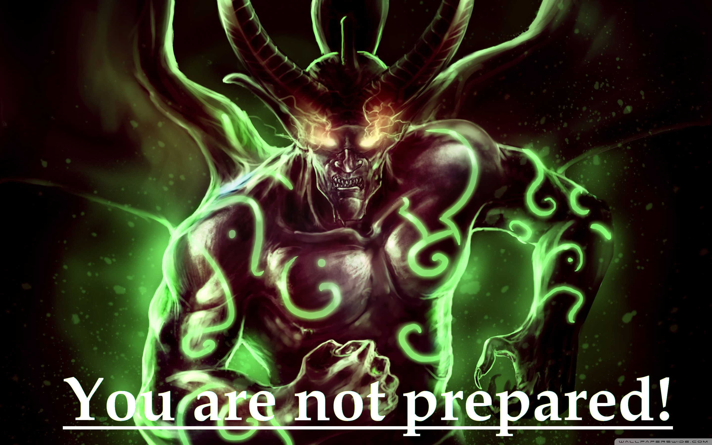

# Way! #
*Who Are You in World of Warcraft*

The **ultimate quiz** to decide for **once and for all** which faction, race, class and role you belong to in the populair MMORPG [World of Warcraft](https://worldofwarcraft.com/en-us/). 

---
## UX (User Experience) ##
---
### Project Goals ###
The **goal** for this project is to **entertain** users.

### User Goals ###
* **Find** out which [World of Warcraft](https://worldofwarcraft.com/en-us/) faction, race, class and role you are.
* Be **entertained**.
* **Find** beautiful **images** of World of Warcraft races and classes.

### User Stories ###
* As a **user**, I want and **attractive** and **fun** website so I will be **entertained**.
* As a **user**, I want a **site** that loads fast.
* As a **user**, I want to have clearly defined **questions** and **answers**.
* As a **user**, I want to be able to **post** my results to various **social media sites**.
* As a **user**, I want to be able to **mail** the site owner if I have **questions**, want to **suggest content** or pay a compliment.

### Site Owner Goals ###
* As a **site owner** I want to educate my users.
* As a **site owner** I want my users to be able to **contact** me.

### User Requirements and Expectations ###

**Requirements**
* **Navigate** the website using the navbar.
* Have a **intuitive** layout that is easy to use.
* **Fun questions** that lead to an **equally fun** (and perhaps true) **outcome**.
* Be able to **share** results on **social media**.

**Expectations**

